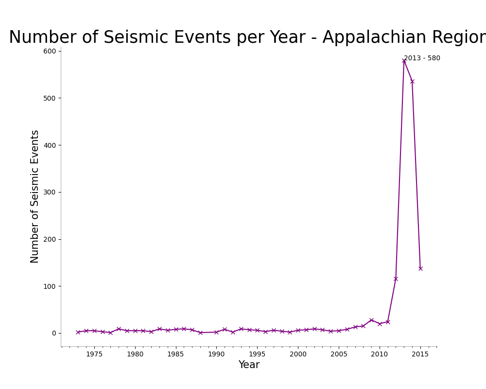
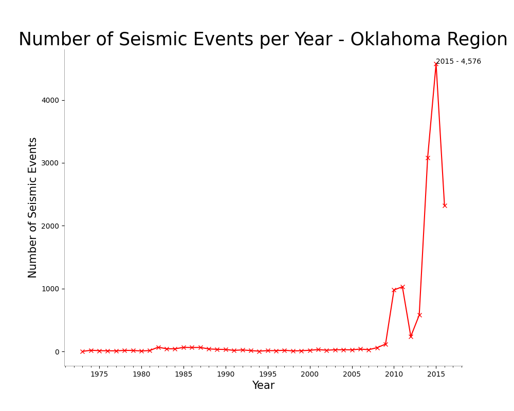

# Wastewater_And_Seismic_Activity
---
### Description

Analyzing the relationship between wastewater dumping and seismic activity in the Appalachian Basin Region and in the Oklahoma Region.  In recent years, both the Appalachian Basin and Oklahoma regions have experienced significant increases in seismic activity. A growing body of research suggests that this rise may be linked to wastewater injection—a common byproduct of hydraulic fracturing (fracking). Understanding this relationship is critical for assessing environmental risks and developing strategies to minimize human-induced seismic events.

---
### Getting Started


#### Installing
1. Clone this repository.

2. Install the required Python packages:
```javascript  
pip install -r requirements.txt
```
3. git remote set-url origin
 ```javascript
github_username/repo_name
git remote -v 
```
4. Open file in preferred program.
ex: VSCode
---
### Roadmap
Notebooks
- Appalachian_Basin_Earthquakes.ipynb
    - Used to explore seismic events in the Appalachian Basin Region.
- Ok_Region_Earthquakes.ipynb
    - Used to explore seismic events in the Oklahoma Region.
- Ok_Region_Wells.ipynb
    - Used to explore injection wells within the state of Oklahoma.
- database.ipynb
    - SQL database used to explore connections between Oklahoma seismic events and Oklahoma injection wells.
    
Data
 - CSV's used and created.

Plots
- Images rendered from data.
---
### Examples

Showing similarities of seismic events in different regions:



---
### Data Sources
1. earthquakes.csv
    + Fields: event locations (latitude, longitude, state), as well as date, time, event ID, magnitude (including magnitude types), and depth.
    + [Appalachian Basin Play Fairway Analysis, Gravity, Magnetics, and Earthquake data - data.gov](https://catalog.data.gov/dataset/appalachian-basin-play-fairway-analysis-gravity-magnetics-and-earthquake-data-ea46d)


2. okQuakes.csv
    + Fields: event locations (latitude, longitude, state), as well as date, time, event ID, magnitude (including magnitude types), and depth.
    + [Oklahoma Earthquakes and Saltwater Injection Wells - kaggle.com](https://www.kaggle.com/datasets/ksuchris2000/oklahoma-earthquakes-and-saltwater-injection-wells)

3. InjectionWells.csv
    + Fields: well locations(latitude, longitude, state), operators, and approval dates, psi, and barrels of fluid.
    + [Oklahoma Earthquakes and Saltwater Injection Wells - kaggle.com](https://www.kaggle.com/datasets/ksuchris2000/oklahoma-earthquakes-and-saltwater-injection-wells)

---
### Author
Julie Gambill - Data Analyst

### Other Information
* AI used to reformat event location information.
    * example: *33km NW of Fairview, Oklahoma* to *"33km NW of Fairview, Oklahoma",*.
    * reason:  over 13,000 lines of code needed to be formatted with quotes(""), and a comma (,) for renaming function.